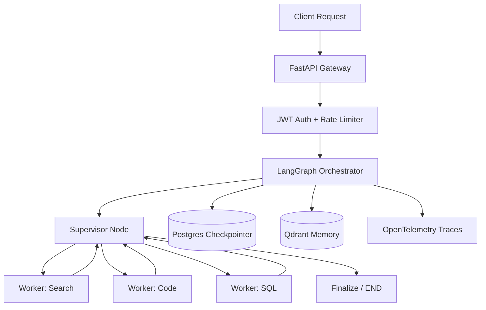

# 🗺️ Agentic Systems Map of Content

> Central index for the AI Agent Orchestration Vault. Every sub-domain links back here via `[[00 - MOC (Agentic Systems Map)]]`.

---

## 🏛️ 01 – Core Architectures

| Note | Key Concepts |
|---|---|
| [[LangGraph State Machine & Checkpointing]] | Typed state, reducers, PostgresSaver, cyclic loops |
| [[CrewAI Hierarchical Delegation]] | Role assignment, process hierarchy, task handoff |
| [[ReAct vs Plan-and-Solve Paradigms]] | Thought-action loops, scratchpad planning, benchmarks |

---

## 🧠 02 – Memory Systems

| Note | Key Concepts |
|---|---|
| [[Short-Term State & Checkpointing (Postgres)]] | Thread snapshots, checkpoint_id, psycopg3 |
| [[Long-Term Semantic Vector Memory (Qdrant)]] | HNSW, cosine similarity, episodic recall |

---

## 🔧 03 – Tooling & Guardrails

| Note | Key Concepts |
|---|---|
| [[Structured Tool Calling & Pydantic Schemas]] | Tool schemas, validation, JSON-mode |
| [[Failure Recovery & Self-Healing Loops]] | Retry backoff, human-in-the-loop, circuit breaker |

---

## 📊 04 – Evaluation & Tracing

| Note | Key Concepts |
|---|---|
| [[LLM-as-a-Judge Evaluation Framework]] | Rubric scoring, pairwise preference, auto-eval |
| [[OpenTelemetry & Langfuse Telemetry]] | Spans, traces, Langfuse SDK, OTLP exporter |

---

## ⚡ Production Benchmarks

| Execution Phase | Stack | p95 Latency | Limit |
|---|---|---|---|
| Ingress & Auth | FastAPI + JWT | 4–8 ms | 10,000 req/min |
| Router LLM | GPT-4o-mini | 450–700 ms | Provider tier |
| Vector Retrieval | Qdrant HNSW | 12–25 ms | 1,500 QPS |
| State Persistence | Postgres psycopg3 | 5–15 ms | Pool: 20 conn |
| Specialist LLM | GPT-4o | 1,200–2,800 ms | 4,096 tokens |

---

## 🔗 System Architecture

