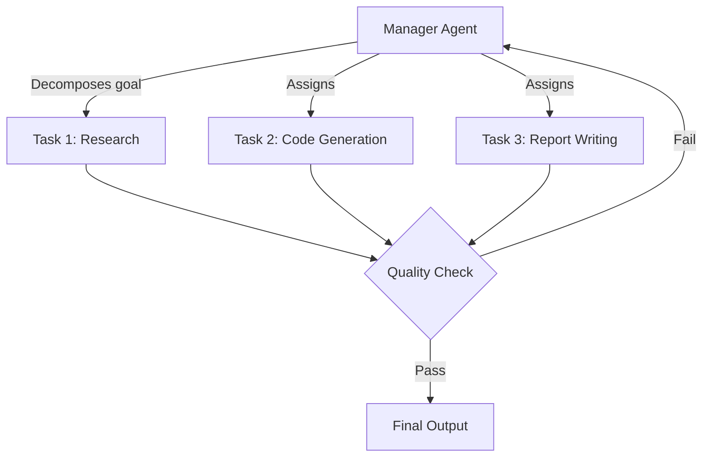

# CrewAI Hierarchical Delegation

CrewAI implements a role-based, top-down agent delegation model where a **Manager Agent** decomposes tasks and assigns them to **Specialist Agents** (Crew Members). The manager evaluates outputs and decides whether to iterate or finalize.

## Key Concepts

- **Crew**: The top-level container defining process type (`hierarchical` | `sequential`), agents, and tasks.
- **Agent**: An autonomous entity with a defined `role`, `goal`, `backstory`, and `tools`.
- **Task**: A discrete unit of work assigned to a specific agent, with an `expected_output` contract.
- **Process**: Controls execution flow. `hierarchical` enables manager-driven delegation.

## Delegation Flow



## Code Pattern

```python
from crewai import Agent, Crew, Task, Process

researcher = Agent(
    role="Senior Research Analyst",
    goal="Find authoritative information on {topic}",
    backstory="10 years of experience in technical research.",
    tools=[search_tool],
    verbose=True,
)

coder = Agent(
    role="Python Engineer",
    goal="Implement production-quality code for the given specification.",
    backstory="Expert in async Python and LLM tooling.",
    tools=[code_interpreter],
)

research_task = Task(
    description="Research the latest advancements in {topic}",
    expected_output="A structured summary with citations.",
    agent=researcher,
)

crew = Crew(
    agents=[researcher, coder],
    tasks=[research_task],
    process=Process.hierarchical,
    manager_llm="gpt-4o",
    verbose=True,
)
result = crew.kickoff(inputs={"topic": "LangGraph state persistence"})
```

## vs. LangGraph

| Dimension | CrewAI | LangGraph |
|---|---|---|
| Execution model | Role-based delegation | State machine with typed edges |
| State management | Task context propagation | Typed `TypedDict` with reducers |
| Persistence | In-memory / custom | Native `PostgresSaver` |
| Cyclic loops | Via manager re-delegation | Native graph cycles |
| Best for | Team simulations, report gen | Stateful, long-horizon agentic flows |

## Related

- [[LangGraph State Machine & Checkpointing]]
- [[ReAct vs Plan-and-Solve Paradigms]]
- [[00 - MOC (Agentic Systems Map)]]
