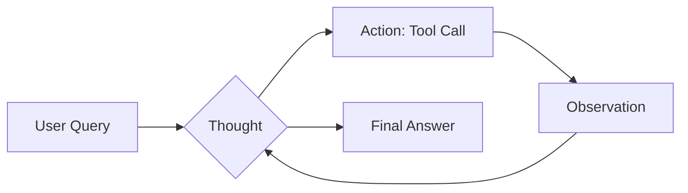
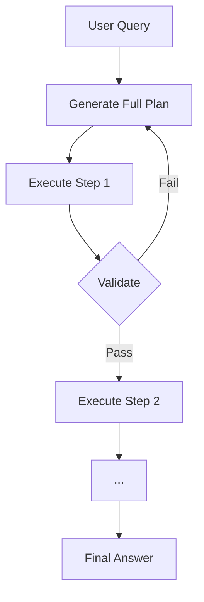

# ReAct vs Plan-and-Solve Paradigms

Two dominant reasoning-action paradigms for LLM agents. Selection depends on task horizon, reversibility, and token budget constraints.

## ReAct (Reason + Act)

Interleaves **Thought → Action → Observation** in a tight single-step loop. The model reasons about the current context, takes one tool action, observes the result, and repeats until a final answer is reached.

**Strengths**: Low overhead, adaptive, works well for open-domain Q&A and tool use.  
**Weaknesses**: Prone to "thought spirals" on multi-step tasks; no upfront plan.

```
Thought: The user is asking about the latest unemployment rate.
Action: search("US unemployment rate 2026")
Observation: "3.9% as of Q1 2026 per BLS"
Thought: I now have the answer.
Final Answer: The US unemployment rate is 3.9% as of Q1 2026.
```

### Loop Diagram



---

## Plan-and-Solve (PaS)

Generates a **complete plan** in a single forward pass before any action. Executes steps sequentially against the plan. Validated intermediate results gate progression.

**Strengths**: Structured, auditable, better on multi-step math and code tasks.  
**Weaknesses**: Front-loaded token cost; brittle when observations deviate from plan.

```
Plan:
  Step 1: Identify the required data sources.
  Step 2: Query each source sequentially.
  Step 3: Cross-validate outputs.
  Step 4: Synthesize final answer.

Execute Step 1: ...
Execute Step 2: ...
```

### Loop Diagram



---

## Head-to-Head Comparison

| Dimension | ReAct | Plan-and-Solve |
|---|---|---|
| Planning overhead | None | High (upfront plan) |
| Token efficiency | High | Moderate |
| Multi-step tasks | Moderate | Excellent |
| Error recovery | Adaptive | Replan required |
| Auditability | Low (inline) | High (explicit plan) |
| Best for | Retrieval, Q&A | Math, code, reports |

## Hybrid: Plan-Then-React

Production systems often combine both: generate a high-level plan (PaS) and execute each step using a ReAct inner loop.

## Related

- [[LangGraph State Machine & Checkpointing]]
- [[CrewAI Hierarchical Delegation]]
- [[Failure Recovery & Self-Healing Loops]]
- [[00 - MOC (Agentic Systems Map)]]
