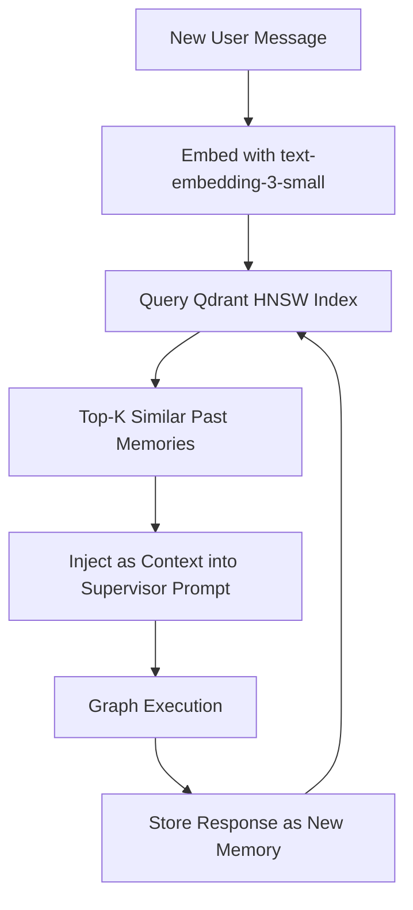

# Long-Term Semantic Vector Memory (Qdrant)

Long-term memory persists **episodic interactions** across sessions. Each user–agent exchange is encoded as a dense embedding vector and stored in Qdrant. On new turns, relevant past context is retrieved via HNSW approximate nearest neighbor search.

## Architecture



## Collection Configuration

```python
from qdrant_client import AsyncQdrantClient
from qdrant_client.models import Distance, VectorParams

client = AsyncQdrantClient(url="http://localhost:6333")

await client.create_collection(
    collection_name="agent_memory",
    vectors_config=VectorParams(
        size=1536,            # text-embedding-3-small dimension
        distance=Distance.COSINE,
    ),
)
```

## HNSW Index Parameters

| Parameter | Default | Notes |
|---|---|---|
| `m` | 16 | Number of bi-directional links per layer |
| `ef_construct` | 100 | Build-time search width (higher = better recall) |
| `ef` | 128 | Query-time candidate pool size |
| Distance | Cosine | Normalized dot product; range [0, 1] |

## Upsert Flow

```python
from qdrant_client.models import PointStruct

# Get embedding from OpenAI
response = await openai.embeddings.create(
    model="text-embedding-3-small",
    input="User's message text here"
)
vector = response.data[0].embedding

# Store in Qdrant
await client.upsert(
    collection_name="agent_memory",
    points=[PointStruct(
        id=str(uuid.uuid4()),
        vector=vector,
        payload={
            "thread_id": "abc123",
            "role": "user",
            "content": "User's message text here",
            "created_at": time.time()
        }
    )]
)
```

## Filtered Search (Per-Thread Recall)

```python
from qdrant_client.models import Filter, FieldCondition, MatchValue

results = await client.search(
    collection_name="agent_memory",
    query_vector=query_embedding,
    limit=5,
    query_filter=Filter(
        must=[FieldCondition(key="thread_id", match=MatchValue(value="abc123"))]
    ),
    with_payload=True,
)
```

## Performance Targets

| Metric | Single Replica | Notes |
|---|---|---|
| p95 query latency | 12–25 ms | HNSW indexed, cosine |
| Max QPS | 1,500 | Single node |
| Collection size | Unlimited | Disk-backed segments |
| Recall@10 | ~99% | With ef=128 |

## Related

- [[Short-Term State & Checkpointing (Postgres)]]
- [[Structured Tool Calling & Pydantic Schemas]]
- [[OpenTelemetry & Langfuse Telemetry]]
- [[00 - MOC (Agentic Systems Map)]]
