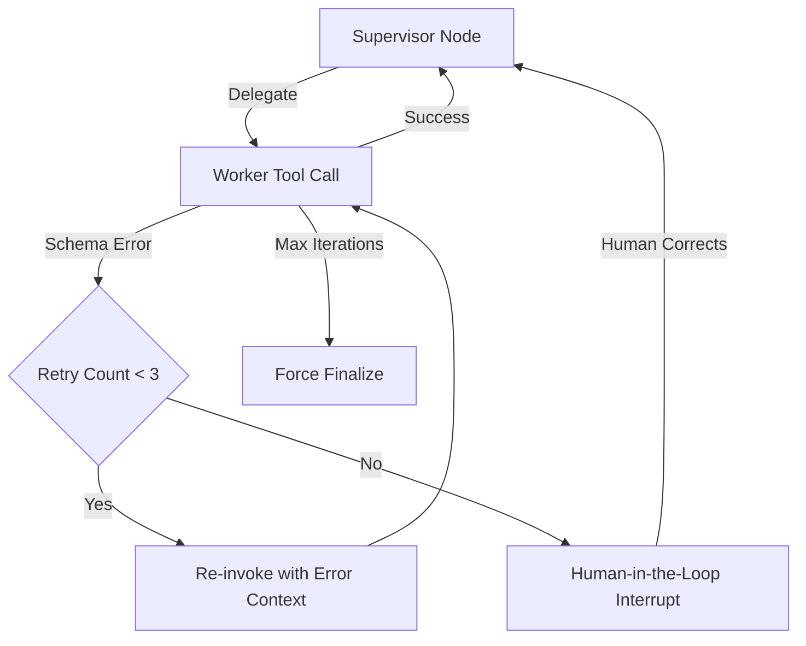

# Failure Recovery & Self-Healing Loops

Production agent systems must handle tool failures, schema violations, LLM hallucinations, and infrastructure outages gracefully. Self-healing loops implement automatic remediation before escalating to a human.

## Failure Taxonomy

| Failure Type | Cause | Recovery Strategy |
|---|---|---|
| Schema Validation Error | Bad tool arguments | Retry with corrected prompt |
| LLM Timeout | Provider latency | Exponential backoff + fallback model |
| Tool Execution Error | External API failure | Circuit breaker → cached fallback |
| Infinite Loop | Supervisor stuck | Max iteration guard → finalize |
| Context Overflow | Token limit exceeded | Summarize + trim message history |

## Retry Loop with Backoff

```python
import asyncio
import random

async def with_retry(fn, max_retries: int = 3, base_delay: float = 1.0):
    """Exponential backoff with full jitter."""
    for attempt in range(max_retries):
        try:
            return await fn()
        except Exception as exc:
            if attempt == max_retries - 1:
                raise
            delay = base_delay * (2 ** attempt) + random.uniform(0, 1)
            await asyncio.sleep(delay)
```

## Circuit Breaker Pattern

```python
from enum import Enum

class CircuitState(Enum):
    CLOSED = "closed"       # Normal operation
    OPEN = "open"           # Tripped – rejecting calls
    HALF_OPEN = "half_open" # Testing recovery

class CircuitBreaker:
    def __init__(self, failure_threshold: int = 5, recovery_timeout: float = 30.0):
        self.state = CircuitState.CLOSED
        self.failure_count = 0
        self.threshold = failure_threshold
        self.recovery_timeout = recovery_timeout
        self.opened_at: float = 0.0

    def record_failure(self):
        self.failure_count += 1
        if self.failure_count >= self.threshold:
            self.state = CircuitState.OPEN
            self.opened_at = time.monotonic()

    def is_available(self) -> bool:
        if self.state == CircuitState.OPEN:
            if time.monotonic() - self.opened_at > self.recovery_timeout:
                self.state = CircuitState.HALF_OPEN
                return True
            return False
        return True
```

## Self-Healing Loop in LangGraph



## Max Iteration Guard

```python
def router_logic(state: AgentState) -> str:
    # Hard circuit breaker – never exceed 10 total node transitions
    if len(state.get("trace", [])) > 10:
        return END

    if not state.get("is_valid", True):
        return END

    return state.get("next_step", "finalize")
```

## Human-in-the-Loop Interrupt

```python
# Compile graph with interrupt before human-review node
graph = builder.compile(
    checkpointer=checkpointer,
    interrupt_before=["human_review"],  # Pause before this node
)

# Resume after human provides correction
graph.invoke(
    {"messages": [HumanMessage(content="Corrected input here")]},
    config={"configurable": {"thread_id": thread_id}},
)
```

## Related

- [[LangGraph State Machine & Checkpointing]]
- [[Structured Tool Calling & Pydantic Schemas]]
- [[LLM-as-a-Judge Evaluation Framework]]
- [[00 - MOC (Agentic Systems Map)]]
