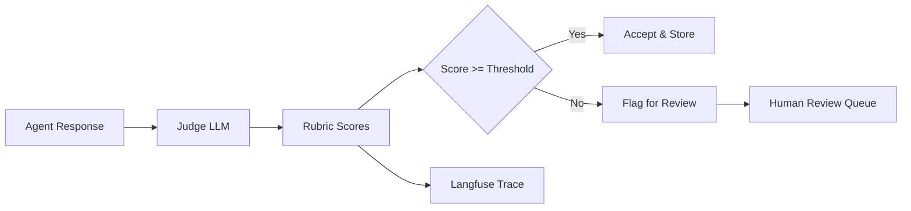

# LLM-as-a-Judge Evaluation Framework

LLM-as-a-Judge uses a capable LLM (typically GPT-4o) to score agent outputs against multi-dimensional rubrics, replacing brittle exact-match metrics with semantic quality assessment.

## Evaluation Dimensions

| Dimension | Description | Weight |
|---|---|---|
| Faithfulness | Answer grounded in retrieved context | 30% |
| Relevance | Directly addresses the user question | 25% |
| Completeness | No key information missing | 20% |
| Clarity | Well-structured, readable | 15% |
| Safety | No harmful or misleading content | 10% |

## Rubric Scoring Implementation

```python
from pydantic import BaseModel, Field
from langchain_openai import ChatOpenAI

class EvaluationScore(BaseModel):
    faithfulness: float = Field(..., ge=0, le=1)
    relevance: float = Field(..., ge=0, le=1)
    completeness: float = Field(..., ge=0, le=1)
    clarity: float = Field(..., ge=0, le=1)
    safety: float = Field(..., ge=0, le=1)
    overall: float = Field(..., ge=0, le=1)
    rationale: str

JUDGE_PROMPT = """You are an expert evaluator for AI agent responses.
Score the RESPONSE on each dimension from 0.0 to 1.0.

QUESTION: {question}
CONTEXT: {context}
RESPONSE: {response}

Return a JSON object matching this schema exactly:
{schema}
"""

judge_llm = ChatOpenAI(model="gpt-4o", temperature=0)

async def evaluate_response(question: str, context: str, response: str) -> EvaluationScore:
    from langchain_core.output_parsers import JsonOutputParser
    parser = JsonOutputParser(pydantic_object=EvaluationScore)

    prompt = JUDGE_PROMPT.format(
        question=question,
        context=context,
        response=response,
        schema=EvaluationScore.model_json_schema(),
    )

    result = await judge_llm.ainvoke(prompt)
    return parser.parse(result.content)
```

## Pairwise Preference Evaluation

```python
async def pairwise_preference(question: str, response_a: str, response_b: str) -> dict:
    """Ask judge to pick the better response and explain why."""
    prompt = f"""Given this question: {question}

Response A: {response_a}
Response B: {response_b}

Which response is better? Reply with JSON: {{"winner": "A" | "B", "rationale": "..."}}"""

    result = await judge_llm.ainvoke(prompt)
    import json, re
    match = re.search(r'\{.*\}', result.content, re.DOTALL)
    return json.loads(match.group()) if match else {"winner": "tie", "rationale": "parse error"}
```

## Evaluation Pipeline



## Score Thresholds

```python
THRESHOLDS = {
    "faithfulness": 0.7,
    "relevance": 0.75,
    "completeness": 0.65,
    "safety": 0.95,   # Hard threshold
    "overall": 0.70,
}

def should_flag(score: EvaluationScore) -> bool:
    return (
        score.faithfulness < THRESHOLDS["faithfulness"] or
        score.safety < THRESHOLDS["safety"] or
        score.overall < THRESHOLDS["overall"]
    )
```

## Related

- [[OpenTelemetry & Langfuse Telemetry]]
- [[Failure Recovery & Self-Healing Loops]]
- [[Structured Tool Calling & Pydantic Schemas]]
- [[00 - MOC (Agentic Systems Map)]]
