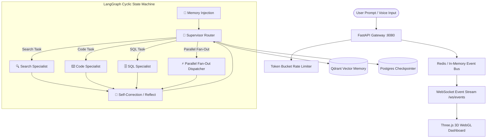

# ⬡ LLM Multi-Agent Orchestrator & 3D Spatial Telemetry Console


A production-grade, enterprise multi-agent orchestration framework powered by **LangGraph cyclic state machines**, **FastAPI gateway**, **Qdrant vector memory**, **Redis event streaming**, and a **Three.js WebGL 3D Spatial Network Telemetry Console**.

Designed for high-throughput AI agent workloads, research, studying, and offline/simulated execution without requiring paid API keys.

---

## 🌟 Key Features

### 🧊 1. 3D Spatial WebGL Multi-Agent Network
- **WebGL Spatial Rendering:** Real-time 3D orbit network visualizing **Supervisor Router**, **Vector Memory**, **Search Specialist**, **Code Specialist**, **SQL Specialist**, and **Reflection Node**.
- **Real-Time Energy Particle Beams:** Glowing 3D energy particles travel along 3D Bezier curve tracks connecting active nodes during execution.
- **3D Floating Text Sprites:** Explicit text labels anchored directly to nodes in 3D space.

### 🧠 2. Topology Connection Memory Matrix
- **Automated Memory Engine:** Memorizes active node transition pathways, run frequencies, and average latency per connection in local state.
- **3D Path Replay:** Click **"Replay 3D Beam"** on any memorized pathway to re-trigger particle trajectories in spatial 3D.

### 🔁 3. Self-Correction & Reflection Loop (`reflect` Node)
- **Automated Quality Guardrail:** Evaluates specialist agent outputs; if response quality or formatting falls below threshold, routes automatically to the `reflect` node to refine code, SQL, or research synthesis before returning to supervisor.

### ⚔️ 4. Multi-LLM Pairwise Battle Arena
- **Side-by-Side Benchmark Comparison:** Compares model configurations (e.g., `GPT-4o` vs `Claude 3.5 Sonnet`) on latency, token costs, LLM-as-a-Judge quality scores, and winner ratings.

### 💻 5. Subprocess Sandbox Terminal Visualizer
- **Isolated Code Telemetry:** Dedicated terminal window displaying real-time `stdout`, `stderr`, exit codes, CPU duration, and memory limits when `worker_code` runs code via `code_exec`.

### 📚 6. Qdrant Vector Memory Inspector Modal
- **Embedding Exploration:** Modal browser displaying Qdrant HNSW vector collection metrics, vector dimensions (`1536`), distance metrics (`Cosine`), and searchable short-term/long-term memory payloads with cosine match percentages.

### 🎙️ 7. Voice Dictation & Telemetry (`Web Speech API`)
- **Speech-to-Text Input:** Dictate prompt instructions directly into the prompt bar using native Web Speech API integration.

### ⚡ 8. Intelligent Offline Simulation Engine
- **Zero API Key Requirement:** Includes a topic-aware synthetic simulation engine generating domain-specific markdown content, SQL plans, and python code blocks with live 15ms streaming token events.

---

## 🏗️ System Architecture



---

## 🚀 Quick Start Guide

### Prerequisites
- Python `3.10` or higher
- Git

### 1. Clone Repository
```bash
git clone https://github.com/HNS-06/LLM_Orchestrator.git
cd LLM_Orchestrator
```

### 2. Install Dependencies
```bash
pip install -r requirements.txt
```

### 3. Environment Configuration
Copy `.env.example` to `.env` (or let the system use simulated mode defaults):
```env
APP_ENVIRONMENT=development
PORT=8080
USE_SIMULATED_LLM=True
OPENAI_API_KEY=your_optional_openai_key
JWT_SECRET_KEY=your_secret_jwt_key
```

### 4. Run Gateway Server
```bash
py fastapi_gateway.py
```

### 5. Access Console
Open your browser and navigate to:
- **Dashboard Web Console:** `http://127.0.0.1:8080/dashboard/`
- **REST API Docs:** `http://127.0.0.1:8080/docs`
- **Health Check:** `http://127.0.0.1:8080/health`

---

## 📂 Directory Structure

```
LLM_Orchestrator/
├── fastapi_gateway.py       # FastAPI HTTP/WebSocket API Gateway & static router
├── langgraph_engine.py      # LangGraph StateGraph engine with reflect self-correction node
├── config.py                # Pydantic settings & environment configuration
├── redis_bus.py             # Event bus dispatcher with fast in-memory fallback
├── tools.py                 # Tool registry (web_search, code_exec, sql_query, memory_recall)
├── metrics.py               # Telemetry, OpenTelemetry & latency benchmarks
├── dashboard/
│   ├── index.html           # 3D WebGL spatial console, Battle Arena, Memory Inspector
│   └── vendor/
│       └── three.min.js     # Bundled Three.js r128 WebGL library
├── requirements.txt         # Python package dependencies
├── .gitignore               # Excludes secrets, bytecode, logs
└── README.md                # Project documentation & specification
```

---

## 🔌 API Reference Highlights

| Endpoint | Method | Description |
| :--- | :--- | :--- |
| `/health` | `GET` | Gateway health ping and feature availability status |
| `/dashboard/` | `GET` | Serves the Three.js 3D Spatial Telemetry Console |
| `/api/v1/memory/inspect` | `GET` | Inspects stored Qdrant vector memory embeddings & metrics |
| `/api/v1/arena/compare` | `POST` | Runs Multi-LLM pairwise benchmark comparisons |
| `/api/v1/threads` | `GET` | Paginated thread execution history |
| `/ws/events` | `WebSocket` | Real-time agent event stream & token streaming endpoint |

---

## 📜 License

Distributed under the **MIT License**. See `LICENSE` for details.
